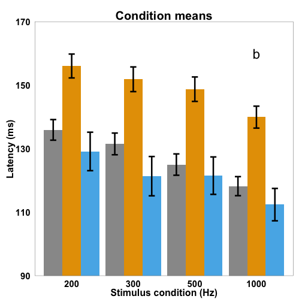
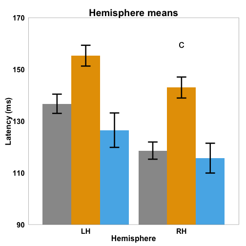
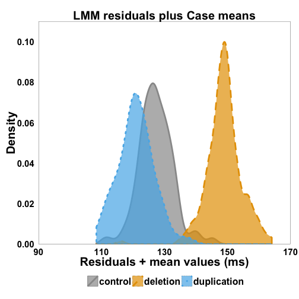

M100 latency in 16p11.2 carriers
========================================================
author: Julian
date: July/August 2015
css: custom.css
autosize: true

Executive summary
========================================================
- 16p11.2 deletion carriers exhibited delalyed M100 latencies  
- Differences are larger than in 'idiopathic' ASD  
- No oberserved differences between controls and 16p11.2 duplication carriers

Participants (recruited)
========================================================
- 137 children  
+ CHOP: 63, UCSF: 74
- 46 16p11.2 deletion carriers  
- 26 16p11.2 duplication carriers  
- 66 age-matched controls  

Participants (final)
========================================================
- 99 children  
  + CHOP: 47, UCSF: 52  
- 35 16p11.2 deletion carriers  
- 16 16p11.2 duplication carriers  
- 48 age-matched controls 

Particpants (final)
========================================================
|---|Age-matched controls	| 16p11.2 deletion carriers	| 16p11.2 duplication carriers|
|:-----|-----|-----|-----
|Age range (years) |	7.31 - 17.15	|7.98 - 17.03 |	7.38 - 16.92
|Mean age (years) |	12.82±2.56 |	11.32±.2.65 |	11.45±2.41
|N (evaluable) |	45 |	35 |	16
|NVIQ|	105.73±11.88 |	90.09±15.07 |	83.06±10.68
|VIQ|	107.24±13.72|	85.37±17.05 |	91.69±14.09
|CELF-4|	106.22±11.22 |	75.81±20.80 |	84.62±13.18
|SRS|	16.68±11.89 |	71.51±34.38 |	72.06±41.22
|CTOPP nonword repetition |	9.23±1.95 |	5.64±2.64 |	7.64±1.45

Procedure
========================================================
- passive presentation of binaural sinusoidal tones  
- recording from whole-head magnetometer  
- analysis: artifact rejection, bandpass filtering, source estimation

Statistical analysis
========================================================
- M100 latency: dependent variable  
- Linear Mixed Models via `lme4`  
- model: `Hemisphere + Stimulus Condition + Case + Age + Site + (Stimulus Condition + Hemisphere | Subject)`  
- significance: Wald Type II $\chi$^2^ tests; Tukey HSD, correlation tests

Complete observations
========================================================

|Case        | compCases|   n| failCases|
|:-----------|---------:|---:|---------:|
|control     |       266| 384|       118|
|deletion    |       203| 280|        77|
|duplication |        65| 128|        63|

M100 latency effects - condition means
========================================================
 

M100 latency effects - hemisphere means
========================================================
 

M100 latency effects - mean responses
========================================================
|Mean | Age-matched controls | 16p11.2 deletion carriers | 16p11.2 duplication carriers|
|:-----|-----|-----|-----
|Overall (ms) |	127.2±3.1	| 149.0±3.6 |	120.9±5.3
|LH (ms) | 136.7±3.7	| 155.3±4.0 | 126.5±6.6
|RH (ms) | 118.6±3.3 | 143.0±4.1 | 115.7±5.8

Effect size estimation
========================================================

|lhs                    | rhs|   estimate|       se|          t|         p|
|:----------------------|---:|----------:|--------:|----------:|---------:|
|deletion - control     |   0|  20.943815| 4.343121|  4.8222961| 0.0000037|
|duplication - control  |   0|  -5.448478| 5.569807| -0.9782167| 0.5878473|
|duplication - deletion |   0| -26.392292| 5.636830| -4.6821162| 0.0000069|

Variance differences
========================================================
 

Conclusion
========================================================
 - main result: ~20 ms delay in M100 component in 16p11.2 deletion carriers  
 - no observed significant difference bewtween 16p11.2 duplication carriers and controls  
- effects not inconsistent with other reported effects
- support for gene-neurophysiology association
